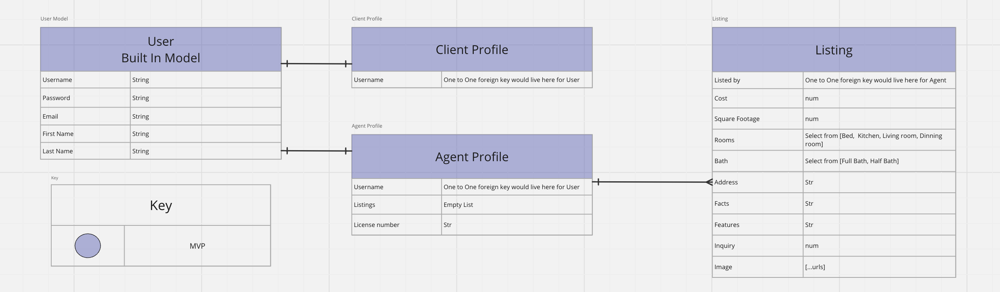

# Vogue-Estates-FrontEnd
Welcome to the Vogue Estates Luxury Real-Estate Frontend! This frontend provides a user-friendly interface for exploring exclusive luxury listings from Vogue Estates. Whether you're a prospective buyer or simply browsing, our platform offers a seamless experience to discover the epitome of elegance and sophistication in luxury real estate.

##  Trello 
https://trello.com/b/0mWjNa2M/vogue-properties

## Wire Frames

## ERD

## Component Hierarchy Diagram

l

## Getting started 
Account Creation: Begin your journey by creating a personalized account on Vogue Estates. This straightforward and secure process ensures that you have a unique space to explore our exclusive luxury listings.

Browse Listings: Once you've successfully logged in, you'll gain access to our extensive collection of luxury properties. Browse through our listings to discover the epitome of elegance and sophistication.

Contact Agents: Should you find a property that captivates your interest, utilize the provided contact forms to reach out to our dedicated agents. They're here to assist you in turning your real estate dreams into reality.

Agent Tools: As a Vogue Estates agent, you have access to powerful tools for managing listings which includes adding and removing their listing. Add exclusive properties to our collection and remove listings as needed to ensure our users have access to the finest luxury real estate offerings.

## Contributing
- Antwon F.	https://github.com/AntwonLF (Front-end)
- Wyatt S.	https://github.com/wysmith00 (Front-end)
- Lesley R. https://github.com/GlitterAngle (Full-stack)
- Aldiana H. https://github.com/aldianahot14 (Full-stack)

## Attributions and Tech Used
- React
- React Spring
- React Documentation
- Notion
- Netlify
- Emaijs
- ChatGPT

# Installation
To set up the front-end environment:

Clone the repository: git clone [https://github.com/AntwonLF/Vogue-Estates-FrontEnd.git]
Install dependencies: npm install
Start the development server: npm start

# Daily Meetings
Morning check-ins with Emre and mid-day check-ins with the team.
Office meetings with Grant as needed.

## MVP
- User should be able to signup as a Client or Agent.
- Auth User should be able to view listings on the the listing page.
- Agent should be able to add, update and remove listings in vogue estates.

## StretchGoals
- User should be able to Facetime with Agent.
- User should be able to use inqury form to email an actual.
- Agent (one of the group members).
- User should be able to use interactive map on Locations page.

## Next-Step
- Develop and integrate a user-friendly sharing feature that allows clients to effortlessly share content with their friends and family.
- Enhance the website's design and functionality to offer a more seamless and advanced user experience.

